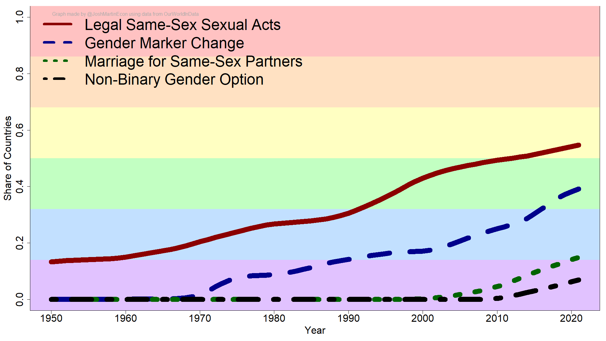
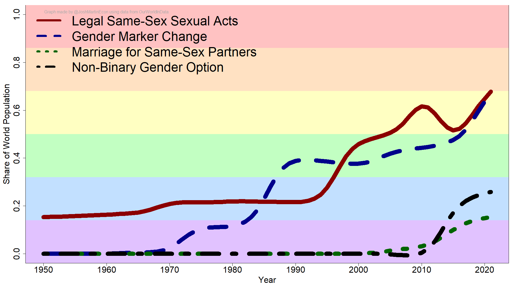

# Background

[Bastian Herre](https://x.com/bbherre) posted a very [interesting article over at OurWorldInData](https://ourworldindata.org/progress-lgbt-rights) on the progress of federally recognized LGBTQ rights. One broad takeaway from the article was to illustrate the positive trend in the recognition of queer rights over time. I was (slightly) skeptical of this hypothesis.

# Hypothesis

My thinking was that while the trend was increasing in terms of the share of countries recognizing LGBTQ rights, the change in the population who enjoy the benefits of protections would be significantly more muted.

The article contains publicly accessible data so I decided to check if I was correct. [Here is a link to my code](https://github.com/joshmartinecon/lgbtq-rights-progress/blob/main/ourworldindata%20lgbt%20rights.R) to see how I define these policies and to check for any mistakes.

# Finding

I replicated the main finding that the share of countries with legal protections for LGBTQ individuals has increased steadily over time. This rate of change has been < 1 percentage point per year in the past decade.

When adjusting for the share of the population covered by the policies, I can see that my hypothesis was incorrect. Not only are the absolute shares of individuals covered by these policies greater than the share of countries, but also the rate of change is significantly larger with an average growth rate of ~1.4 percentage points per year!

